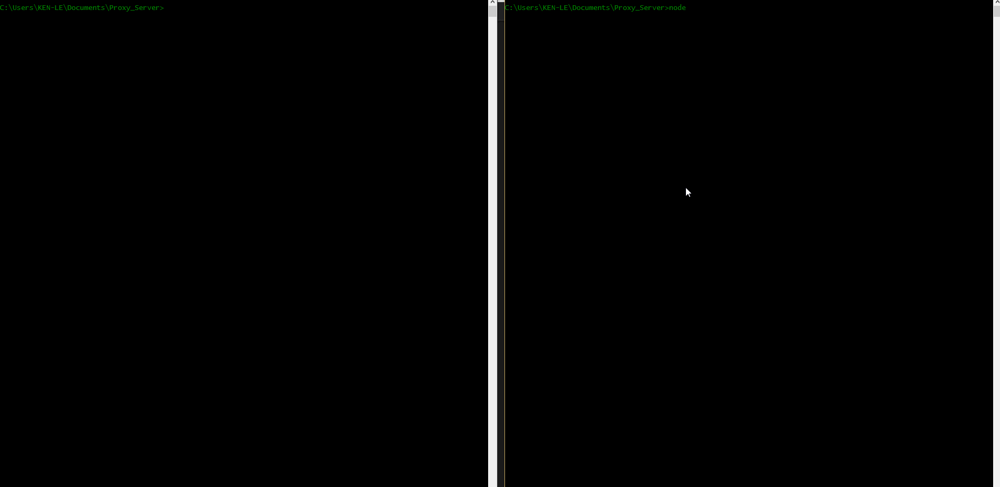

# Proxy Server

This is a Proxy Server for Node.js submitted as the [pre-work](https://github.com/letrungkien0210/Proxy_Server.git) requirement for CodePath.

Time spent: 20 hours

Completed:

* [x] Required: Requests to port `8000` are echoed back with the same HTTP headers and body
* [x] Required: Requests/reponses are proxied to/from the destination server
* [x] Required: The destination server is configurable via the `--host`, `--port`  or `--url` arguments
* [] Required: The destination server is configurable via the `x-destination-url` header
* [x] Required: Client requests and respones are printed to stdout
* [x] Required: The `--logfile` argument outputs all logs to the file specified instead of stdout
* [x] Optional: The `--exec` argument proxies stdin/stdout to/from the destination program
* [] Optional: The `--loglevel` argument sets the logging chattiness
* [] Optional: Supports HTTPS
* [x] Optional: `-h` argument prints CLI API

Walkthrough Gif:
walkthrough.gif



Note: to embed the gif file, just check your gif file into your repo and update the name of the file above.

## Starting the Server

```bash
node index.js -p 8000 -x 127.0.0.1
```

## Features

### Echo Server:

```bash
curl -v -X POST http://127.0.0.1:8000 -d "hello self" -H "x-asdf: yodawg"
* Rebuilt URL to: http://127.0.0.1:8000/
*   Trying 127.0.0.1...
* Connected to 127.0.0.1 (127.0.0.1) port 8000 (#0)
> POST / HTTP/1.1
> Host: 127.0.0.1:8000
> User-Agent: curl/7.46.0
> Accept: */*
> x-asdf: yodawg
> Content-Length: 10
> Content-Type: application/x-www-form-urlencoded
>
* upload completely sent off: 10 out of 10 bytes
< HTTP/1.1 200 OK
< host: 127.0.0.1:8000
< user-agent: curl/7.46.0
< accept: */*
< x-asdf: yodawg
< content-length: 10
< content-type: application/x-www-form-urlencoded
< Date: Wed, 05 Oct 2016 16:24:11 GMT
< Connection: keep-alive
<
hello self* Connection #0 to host 127.0.0.1 left intact
```

### Proxy Server:

Port 8001 will proxy to the echo server on port 8000.

```bash
curl -v http://127.0.0.1:8001/asdf -d "hello proxy"
*   Trying 127.0.0.1...
* Connected to 127.0.0.1 (127.0.0.1) port 8001 (#0)
> POST /asdf HTTP/1.1
> Host: 127.0.0.1:8001
> User-Agent: curl/7.46.0
> Accept: */*
> Content-Length: 11
> Content-Type: application/x-www-form-urlencoded
>
* upload completely sent off: 11 out of 11 bytes
< HTTP/1.1 200 OK
< host: 127.0.0.1:8001
< user-agent: curl/7.46.0
< accept: */*
< content-length: 11
< content-type: application/x-www-form-urlencoded
< connection: close
< date: Wed, 05 Oct 2016 16:24:59 GMT
<
hello proxy* Closing connection 0
```

### Configuration:

#### CLI Arguments:

The following CLI arguments are supported:

##### `--host`

The host of the destination server. Defaults to `127.0.0.1`.

##### `--port`

The port of the destination server. Defaults to `80` or `8000` when a host is not specified.

##### `--logfile`

Specify a file path to redirect logging to.
